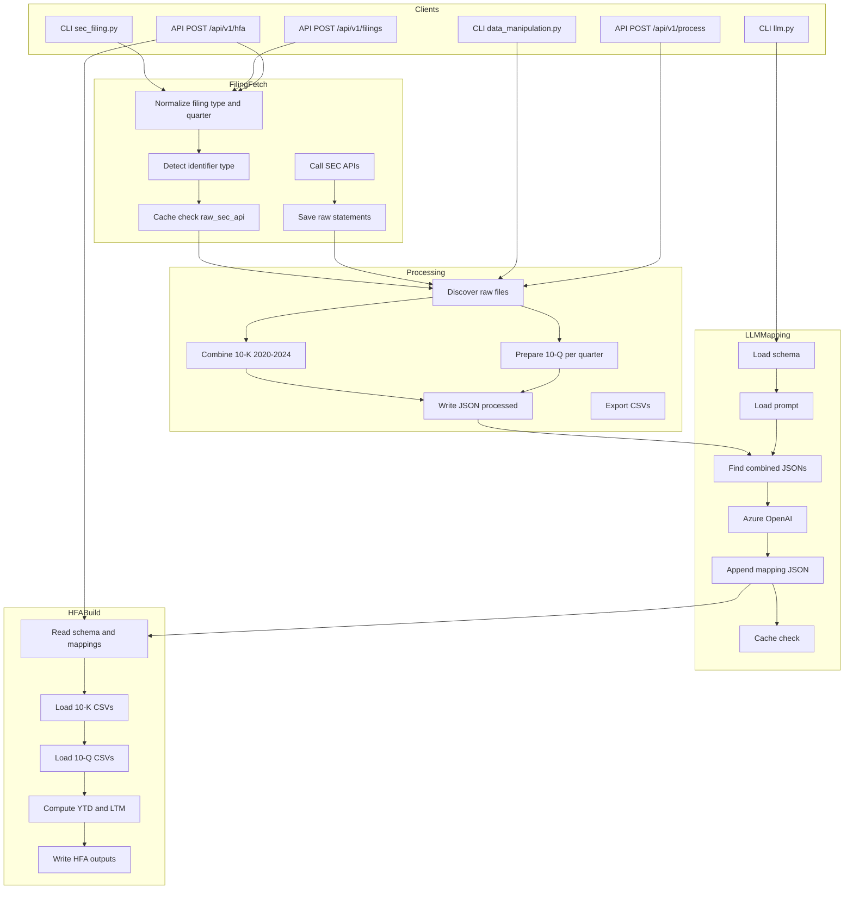
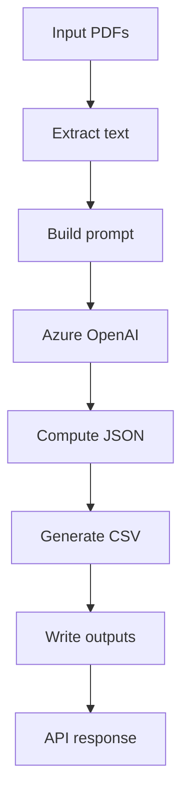
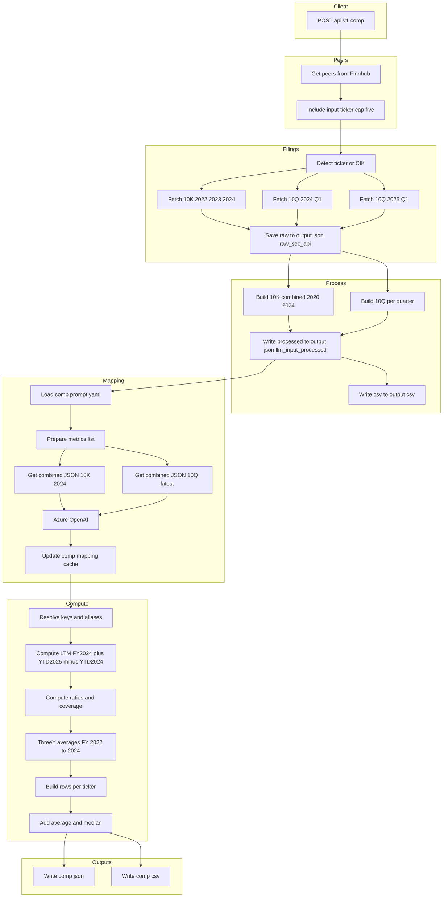

# pgim-dealio

SEC EDGAR financial data extraction and preparation system with both REST API and CLI interfaces. It fetches company financial statements, caches and saves raw outputs, and produces per-period processed JSON ready for downstream use. The system includes modules for Historical Financial Analysis (HFA), Capitalization Table Generation (CAP), and Comparable Analysis (COMP).

## Project Structure
```
pgim-dealio/
├── app.py                          # FastAPI server (main entry point)
├── src/
│   ├── sec_filing.py               # Fetch filings, normalize/validate, cache-first, auto-save raw
│   ├── data_manipulation.py        # Build combined 10-K (by year range) and per-10Q JSON + CSVs
│   ├── llm.py                      # LLM mapping: loads processed files and computes AQRR mappings
│   ├── build_hfa.py                # Build HFA table (2020–2024, YTD 2024, YTD 2025, LTM 2025) using mappings
│   ├── build_cap.py                # Cap table generation from SEC filings using LLM
│   └── comp_analysis.py            # Comparable analysis with peer discovery, metrics calculation
├── azure-functions/                # Azure Functions for serverless backend
│   ├── HFAFunction/                # Historical Financial Analysis function
│   ├── CapTableFunction/           # Capitalization Table function
│   ├── shared_code/                # Shared code for Azure Functions
│   │   ├── auth.py                 # Azure authentication using Service Principal
│   │   └── logging_to_blob.py      # Logging to Azure Blob Storage
│   ├── host.json                   # Azure Functions host configuration
│   ├── local.settings.json         # Local settings for Azure Functions
│   └── README.md                   # Azure Functions documentation
├── utils/
│   ├── prompt.yaml                 # Prompt template used by src/llm.py
│   ├── mapping_calculation.json    # Output cache for AQRR mappings written by src/llm.py
│   ├── cap_prompt.yaml            # Prompt template for cap table generation
│   └── comp_prompt.yaml           # Prompt template for comparable analysis
├── static/
│   └── aqrr_key_schema.yaml        # List of AQRR keys (metrics) to compute
├── output/
│   ├── json/
│   │   ├── raw_sec_api/            # Raw statements saved from filing fetches (cache)
│   │   ├── llm_input_processed/    # Processed, periodized JSON outputs grouped by ticker
│   │   ├── cap_table/              # Cap table JSON outputs: <TICKER>_CAP.json
│   │   ├── comp/                   # Comparable analysis JSON outputs: <TICKER>_2025_Q1.json
│   │   └── hfa_output/             # HFA JSON outputs: <TICKER>_HFA.json
│   └── csv/                        # CSV exports for 10-K, 10-Q, HFA, CAP, and COMP
│       ├── HFA/                    # HFA CSV outputs: <TICKER>_HFA.csv
│       ├── cap_table/              # Cap table CSV outputs: <TICKER>_CAP.csv
│       └── comp/                   # Comparable analysis CSV outputs: <TICKER>_2025_Q1.csv
├── .env                            # Environment variables (SEC_API_KEY, AZURE_OPENAI_API_KEY)
└── requirements.txt                # Python dependencies
```

## Features
- **REST API** and **CLI** to fetch filings and to process saved data
- **Azure Functions** for serverless backend deployment with automatic scaling
- **Azure Blob Storage Logging** for centralized log management
- **Azure Service Principal Authentication** for secure access to Azure resources
- Filing types: **10-K** (annual), **10-Q** (quarterly), **8-K** (current)
- **Normalized inputs**: filing types like "10K" and quarters like "2" become "10-K" and "Q2"
- **Year filtering** using fiscal year (reportDate) with filing date fallback
- **Quarter selection for 10-Q** (Q1–Q4) in both CLI and API
- **Cache-first**: skip remote calls if raw files already exist and have data
- **Auto-save** raw statements to `output/json/raw_sec_api/`
- **Processing pipeline** to produce a combined 10-K JSON (across years) and per-(year, quarter) 10-Q JSON in `output/json/llm_input_processed/`
- **LLM mapping** to compute AQRR metric formulas from processed files
- **SSL bypass** for environments with certificate inspection
- **HFA build** API to orchestrate fetching (10-K 2020/2022/2024 and 10-Q Q1-2025/Q1-2024/Q2-2024/Q3-2024), processing, mapping generation, and emit an HFA table with YTD and LTM columns
- **Cap Table Generation** to extract, process, and generate capitalization tables from SEC filings (10-K and 10-Q) using LLM
- **Comparable Analysis (COMP)** with peer discovery, metrics calculation, and LTM/3-year metrics computation
- **Peer Discovery** via Finnhub API to find comparable companies for analysis

## Data Flow Pipelines

### Main Data Flow Pipeline



### CAP Data Flow Pipeline



### COMP Data Flow Pipeline



### 1. Setup
```bash
# Install dependencies
pip install -r requirements.txt

# Create .env with required keys
echo "SEC_API_KEY=your_sec_api_key" > .env
echo "AZURE_OPENAI_API_KEY=your_azure_openai_key" >> .env
```

### 2. Start API Server
```bash
python app.py
```
Server runs on: `http://localhost:3030`

## API Usage

### 1) Fetch filings and auto-save raw
Endpoint: `POST /api/v1/filings`

Request body schema:
```json
{
  "identifier": "string",     // Ticker (e.g., "ELME") or CIK (e.g., "0000104894")
  "filing_type": "string",    // "10-K" | "10Q" | "10-Q" | "8-K"
  "year": 2024,                 // Optional; latest if omitted
  "quarter": "Q2"              // Required for 10-Q: "Q1".."Q4" or 1..4
}
```

Examples:
- Latest 10-K for a ticker
```json
{ "identifier": "ELME", "filing_type": "10K" }
```
- 2024 10-Q Q2 for a ticker
```json
{ "identifier": "ELME", "filing_type": "10-Q", "year": 2024, "quarter": "Q2" }
```
- Using CIK instead of ticker
```json
{ "identifier": "0000104894", "filing_type": "10-K", "year": 2024 }
```

Response format (abridged):
```json
{
  "metadata": {
    "cik": "0000104894",
    "filing_type": "10-K",
    "year": 2024,
    "filing_url": "https://www.sec.gov/...",  // null if returned from cache
    "quarter": null,
    "from_cache": false
  },
  "statements": {
    "income_statement": { ... },
    "balance_sheet": { ... },
    "cash_flow": { ... }
  }
}
```

### 2) Process raw files into periodized JSON
Endpoint: `POST /api/v1/process`

Request body schema:
```json
{
  "ticker": "ELME",           // required
  "filing_type": "10-Q",      // optional: "10-K" | "10-Q" | "all" (default)
  "years": [2024, 2023],       // optional
  "quarters": ["Q1", "Q2"],   // optional; 10-Q only; also accepts 1..4
  "overwrite": false            // optional; default false
}
```

Examples:
- Process everything available for a ticker:
```json
{ "ticker": "ELME" }
```
- Only 10-K for 2024 and 2023:
```json
{ "ticker": "ELME", "filing_type": "10-K", "years": [2024, 2023] }
```
- Only 10-Q Q1 and Q2 of 2024:
```json
{ "ticker": "ELME", "filing_type": "10-Q", "years": [2024], "quarters": ["Q1", "Q2"] }
```
Response returns a summary of written file paths.

### 3) Build HFA table (orchestrated end-to-end)
Endpoint: `POST /api/v1/hfa`

Request body schema:
```json
{ "ticker": "ELME" }
```

Behavior:
- Fetches raw filings (10-K 2020, 2022, 2024; 10-Q Q1-2025, Q1-2024, Q2-2024, Q3-2024) and saves under `output/json/raw_sec_api/` (cache-first)
- Processes the raw files into combined and per-quarter JSON/CSVs under `output/json/llm_input_processed/` and `output/csv/`
- Generates or reuses mapping formulas in `utils/mapping_calculation.json` via Azure OpenAI
- Builds and writes the HFA outputs

Response format (abridged):
```json
{
  "status": "ok",
  "ticker": "ELME",
  "filing": "10-K",
  "csv_path": "output/csv/HFA/ELME_HFA.csv",
  "json_path": "output/json/hfa_output/ELME_HFA.json",
  "rows": [ { "Metric": "Revenue", "2024": 241935000.0, "YTD 2025": 4486000.0, "LTM 2025": 241779000.0 }, ... ],
  "warnings": [ "Fetch failed for 10-Q 2024 Q2: ..." ]
}
```

### 4) Generate Cap Table
Endpoint: `POST /api/v1/cap-table`

Request body schema:
```json
{ "ticker": "ELME" }
```

Behavior:
- Extracts text from SEC filings (PDFs) for the given ticker from `data/{ticker}/10k.pdf` and `data/{ticker}/10q.pdf`
- Builds a detailed prompt for the LLM, optionally customized per ticker via `utils/cap_prompt.yaml`
- Processes the extracted text using Azure OpenAI GPT-4 to generate a structured cap table
- Validates, computes derived fields (totals, ratios), and converts JSON to CSV
- Saves results to `output/json/cap_table/{ticker}_CAP.json` and `output/csv/cap_table/{ticker}_CAP.csv`

Response format:
```json
{
  "status": "ok",
  "ticker": "ELME",
  "json_path": "output/json/cap_table/ELME_CAP.json",
  "csv_path": "output/csv/cap_table/ELME_CAP.csv",
  "json_data": { ... }  // Parsed cap table JSON
}
```

### 5) Generate Comparable Analysis (COMP)
Endpoint: `POST /api/v1/comp`

Request body schema:
```json
{ "ticker": "PAYX" }
```

Behavior:
- Discovers peers using Finnhub API (if `FINNHUB_API_KEY` is provided)
- Fetches and processes SEC filings for the input ticker and its peers
- Generates mapping formulas using Azure OpenAI (cached in `utils/comp_mapping.json`)
- Computes LTM metrics (FY2024 + YTD2025 - YTD2024) and 3-year averages (FY 2022-2024)
- Calculates financial ratios and metrics for all companies
- Adds average and median rows across companies
- Saves results to `output/json/comp/{ticker}_2025_Q1.json` and `output/csv/comp/{ticker}_2025_Q1.csv`

Response format:
```json
{
  "ticker": "PAYX",
  "tickers": ["PAYX", "ADP", "CDAY", "PCTY", "WDAY"],
  "rows": [ ... ],  // Array of row objects (Ticker + metric columns)
  "json_path": "output/json/comp/PAYX_2025_Q1.json",
  "csv_path": "output/csv/comp/PAYX_2025_Q1.csv",
  "warnings": [ ... ]
}
```

## CLI Usage

### Fetch filings (saves raw files)
```bash
python src/sec_filing.py
```
Prompts:
1) Ticker or CIK
2) Filing type (10-K, 10-Q, 8-K) [default: 10-K]
3) Year (YYYY) or Enter for latest
4) Quarter (required for 10-Q): Q1/Q2/Q3/Q4 or 1–4

Raw files are saved to `output/json/raw_sec_api/`.

### Process raw files into periodized JSON
```bash
python src/data_manipulation.py
```
Notes:
- When you run the script, it will prompt for a ticker in the terminal (e.g., `ELME`).
- The script processes all discovered 10-K and 10-Q raw files for the entered ticker.

Processed files are written under `output/json/llm_input_processed/<TICKER>/` and CSVs under `output/csv/`.

## Output Files

### Raw (cache) — `output/json/raw_sec_api/`
- Ticker-based annual: `TICKER_10-K_YEAR_{income|balance|cashflow}.json`
- Ticker-based quarterly: `TICKER_10-Q_YEAR_Qx_{income|balance|cashflow}.json`
- CIK-based annual: `cik_CIK10_10-K_YEAR_{income|balance|cashflow}.json`
  
### Processed — `output/json/llm_input_processed/<TICKER>/`
- 10-K combined JSON (range): `<TICKER>_10-K_2020-2024_combined.json`
- 10-Q per (year, quarter): `<TICKER>_10-Q_<YEAR>_Qx.json`

### CSV Exports — `output/csv/`
- 10-K combined: `output/csv/<TICKER>/10-K_2020-2024_combined/{balance|income|cashflow}.csv`
- 10-Q per (year, quarter): `output/csv/<TICKER>/10-Q_<YEAR>_Qx/{balance|income|cashflow}.csv`
- HFA table: `output/csv/HFA/<TICKER>_HFA.csv`

### HFA JSON — `output/json/hfa_output/`
- HFA table: `output/json/hfa_output/<TICKER>_HFA.json`

### CAP JSON/CSV — `output/json/cap_table/` and `output/csv/cap_table/`
- Cap table JSON: `output/json/cap_table/<TICKER>_CAP.json`
- Cap table CSV: `output/csv/cap_table/<TICKER>_CAP.csv`

### COMP JSON/CSV — `output/json/comp/` and `output/csv/comp/`
- Comparable analysis JSON: `output/json/comp/<TICKER>_2025_Q1.json`
- Comparable analysis CSV: `output/csv/comp/<TICKER>_2025_Q1.csv`

## Testing

### Postman Testing
1. **URL (filings):** `http://localhost:3030/api/v1/filings`
2. **Method:** POST
3. **Headers:** `Content-Type: application/json`
4. **Body:** Use example JSON requests above

5. **URL (process):** `http://localhost:3030/api/v1/process`
6. **Method:** POST
7. **Headers:** `Content-Type: application/json`
8. **Body:** See examples in the Process API section

9. **URL (hfa):** `http://localhost:3030/api/v1/hfa`
10. **Method:** POST
11. **Headers:** `Content-Type: application/json`
12. **Body:** `{ "ticker": "ELME" }`

13. **URL (cap-table):** `http://localhost:3030/api/v1/cap-table`
14. **Method:** POST
15. **Headers:** `Content-Type: application/json`
16. **Body:** `{ "ticker": "ELME" }`

17. **URL (comp):** `http://localhost:3030/api/v1/comp`
18. **Method:** POST
19. **Headers:** `Content-Type: application/json`
20. **Body:** `{ "ticker": "PAYX" }`

### Interactive Documentation
- **Swagger UI:** `http://localhost:3030/docs`
- **ReDoc:** `http://localhost:3030/redoc`

## Dependencies
- `fastapi` - Web framework
- `uvicorn` - ASGI server
- `pydantic` - Data validation
- `requests` - HTTP client
- `python-dotenv` - Environment variables
- `pyyaml` - YAML parsing for prompts and schemas
- `openai` - Azure OpenAI client for LLM mapping
- `azure-functions` - Azure Functions runtime
- `azure-identity` - Azure authentication
- `azure-storage-blob` - Azure Blob Storage client
- `azure-data-tables` - Azure Table Storage client
- `fitz` (PyMuPDF) - PDF parsing for Cap Table generation
- `pandas` - Data manipulation for COMP and CAP tables

## Configuration
- **Port:** 3030 (configurable in `app.py`)
- **SSL:** Disabled by default for corporate environments
- **SEC API Key:** `.env` -> `SEC_API_KEY`
- **Azure OpenAI Key:** `.env` -> `AZURE_OPENAI_API_KEY`
- **Azure Service Principal:** `.env` -> `AZURE_CLIENT_ID`, `AZURE_CLIENT_SECRET`, `AZURE_TENANT_ID`, `AZURE_SUBSCRIPTION_ID`
- **Finnhub API Key:** `.env` -> `FINNHUB_API_KEY` (optional, for peer discovery in COMP)
- **Cache directory:** `output/json/raw_sec_api/` is created as needed
- **Processed directory:** `output/json/llm_input_processed/` is created as needed
- **Logs directory:** Azure Blob Storage container `logs`

## Notes
- SSL verification is disabled to handle corporate certificate inspection
- For production, configure proper SSL certificates via `REQUESTS_CA_BUNDLE`
- The system automatically detects whether input is a ticker symbol or CIK number

## LLM Mapping: `src/llm.py` and `utils/prompt.yaml`
- `src/llm.py` loads processed JSON under `output/json/llm_input_processed/<TICKER>/` and computes AQRR metric mappings using Azure OpenAI.
- `utils/prompt.yaml` contains the `calculate_aqrr_keys` prompt template. It enforces a strict JSON array output schema.
- `static/aqrr_key_schema.yaml` lists AQRR keys to be computed.
- Outputs are appended to `utils/mapping_calculation.json` per ticker and filing type.

Run locally:
```bash
# Ensure processed files exist for the ticker first
python src/llm.py
```
By default, it looks for:
- 10-K: the latest combined file matching `<TICKER>_10-K_YYYY-<ENDYEAR>_combined.json` and a given `year` in the script.
- 10-Q: the latest quarter file for the specified year.

Environment:
- `.env` must include `AZURE_OPENAI_API_KEY`.
- Azure endpoint and model are specified in `src/llm.py` (`azure_endpoint`, `gpt-4.1`). Update as needed.

## Cap Table Generation: `src/build_cap.py` and `utils/cap_prompt.yaml`

### Overview

The Cap Table Generation module provides an automated pipeline to extract, process, and generate capitalization tables for public companies using their SEC filings (10-K and 10-Q). It leverages Azure OpenAI GPT-4 for intelligent extraction and structuring, and outputs both JSON and CSV formats for downstream analysis.

### Architecture & Data Flow

1. **Input**: SEC filings (PDFs) for a given ticker, located in `data/{ticker}/10k.pdf` and `data/{ticker}/10q.pdf`.
2. **Text Extraction**: PDFs are parsed using PyMuPDF (fitz) to extract raw text.
3. **Prompt Construction**: A detailed prompt is built for the LLM, optionally customized per ticker via a YAML file.
4. **LLM Processing**: The extracted text and prompt are sent to Azure OpenAI GPT-4, which returns a structured cap table in JSON.
5. **Post-Processing**: The JSON is validated, computed (totals, ratios), and converted to CSV.
6. **Output**: Results are saved to `output/json/cap_table/{ticker}_CAP.json` and `output/csv/cap_table/{ticker}_CAP.csv`.

### Customizing Prompts

- **File**: `utils/cap_prompt.yaml`
- **Purpose**: Add ticker-specific instructions for the LLM.
- **Format**:
  ```yaml
  ELME: |
    Please pay special attention to the convertible notes section.
  AME: |
    For AMETEK, include COLs in total debt calculations.
  ```

If a ticker is not present, the default prompt is used.

## Comparable Analysis (COMP): `src/comp_analysis.py` and `utils/comp_prompt.yaml`

### Overview

The COMP module provides an end-to-end pipeline to fetch peers, gather SEC filings, generate calculation mappings with LLM, and compute a Comparable Analysis table with LTM and 3-year metrics. It's exposed via the REST API at `/api/v1/comp` and persists outputs to JSON/CSV.

### Metrics

The table includes, per company (input + up to 4 peers):
- LTM Revenue
- LTM EBITDA
- EBITDA Margin %
- EBITDAR / (Int + Rents)
- (Total Debt + COL) / EBITDAR
- (Net Debt + COL) / EBITDAR
- (Total Debt + COL) / Total Cap
- (FCF + Rents) / (Total Debt + COL)
- 3Y Avg (TD+COL)/EBITDAR
- 3Y Avg (TD+COL)/Total Cap
- 3Y Avg (FCF+Rents)/(TD+COL)
- AVERAGE, MEDIAN rows across companies

### Mapping Generation and Caching

- Prompt: `utils/comp_prompt.yaml` (strict, executable expressions only; no narrative terms)
- LLM: Azure OpenAI via `src/llm.py`
- Cache: `utils/comp_mapping.json`
  - Keys: `<TICKER> -> { "10-K-2024": [<list>...], "10-Q-2025": [<list>...] }`
  - The comp pipeline checks this cache and skips LLM calls if a valid latest entry exists for both labels.

### Peer Discovery

- Finnhub `company_peers(ticker)`; include input ticker; cap to 5 symbols
- Env var: `FINNHUB_API_KEY`
- If missing/unavailable, computes only for the input ticker

## Example API Calls

### cURL — fetch filings
```bash
curl -X POST http://localhost:3030/api/v1/filings \
  -H "Content-Type: application/json" \
  -d '{"identifier":"ELME","filing_type":"10-K"}'
```

### cURL — process saved raw files
```bash
curl -X POST http://localhost:3030/api/v1/process \
  -H "Content-Type: application/json" \
  -d '{"ticker":"ELME","filing_type":"10-Q","years":[2024],"quarters":["Q1","Q2"],"overwrite":false}'
```

### cURL — build HFA (end-to-end)
```bash
curl -X POST http://localhost:3030/api/v1/hfa \
  -H "Content-Type: application/json" \
  -d '{"ticker":"ELME"}'
```

### cURL — generate cap table
```bash
curl -X POST http://localhost:3030/api/v1/cap-table \
  -H "Content-Type: application/json" \
  -d '{"ticker":"ELME"}'
```

### cURL — generate comparable analysis
```bash
curl -X POST http://localhost:3030/api/v1/comp \
  -H "Content-Type: application/json" \
  -d '{"ticker":"PAYX"}' | jq
```

### Python — fetch filings and process
```python
import requests

base = "http://localhost:3030/api/v1"

# 1) Fetch latest 10-K
resp = requests.post(f"{base}/filings", json={
    "identifier": "ELME",
    "filing_type": "10K"
})
resp.raise_for_status()
print(resp.json()["metadata"])  # auto-saved to output/json/raw_sec_api/

# 2) Process into periodized JSON
resp2 = requests.post(f"{base}/process", json={
    "ticker": "ELME",
    "filing_type": "10-Q",
    "years": [2024],
    "quarters": ["Q1", "Q2"],
    "overwrite": False
})
resp2.raise_for_status()
print(resp2.json()["summary"])  # output/json/llm_input_processed/ELME/

# 3) Generate cap table
resp3 = requests.post(f"{base}/cap-table", json={
    "ticker": "ELME"
})
resp3.raise_for_status()
print(resp3.json()["json_path"])  # output/json/cap_table/ELME_CAP.json

# 4) Generate comparable analysis
resp4 = requests.post(f"{base}/comp", json={
    "ticker": "PAYX"
})
resp4.raise_for_status()
print(resp4.json()["tickers"])  # List of tickers used (input + peers)
print(resp4.json()["json_path"])  # output/json/comp/PAYX_2025_Q1.json
```

## Scalable Per‑Ticker Processing Blueprint

- **Idempotent caching**
  - Key raw cache by `(identifier_kind, identifier, filing_type, year, quarter)` and reuse when present (`output/json/raw_sec_api/`).
  - Key processed outputs by `(ticker, filing_type, year, quarter)` under `output/json/llm_input_processed/<TICKER>/`.
- **Asynchronous ingestion**
  - Use a job queue (e.g., Celery/RQ/Arq) to enqueue one job per `(ticker, filing_type, year[, quarter])` with rate‑limits for SEC APIs.
  - De‑duplicate in the queue using a deterministic job id to avoid duplicate work.
- **Backpressure and retries**
  - Exponential backoff on `data.sec.gov` and `sec-api.io` calls; respect 429s.
- **Fan‑out per ticker**
  - For a list of tickers, submit independent jobs; outputs are naturally sharded by `<TICKER>/` directories.
- **LLM cost control**
  - `src/llm.py` has `check_cache_and_get_response()` which skips the LLM call if all required AQRR keys are already present for the ticker+filing type.
  - Store one mapping list per run and append; always read the latest for cache checks.
- **Observability**
  - Log per job: source (cache vs API), files written, and elapsed time. Export to a dashboard for throughput per ticker.

## Troubleshooting
- If `POST /api/v1/process` fails with an import error for `build_processed_for_ticker`, ensure the function exists in `src/data_manipulation.py` or update `app.py` to call the available entry point (e.g., `process_all_filings`).
- Ensure `.env` includes `SEC_API_KEY` (for `sec-api.io`) and `AZURE_OPENAI_API_KEY` (for LLM mapping).
- Corporate SSL inspection may require disabling verification (already handled) or setting `REQUESTS_CA_BUNDLE` properly in production.
- For Azure Functions issues, check the logs in the Azure Blob Storage container `logs`.
- If Azure Functions fail to start locally, ensure you have the Azure Functions Core Tools installed and in your PATH.

## Azure Functions

This project includes Azure Functions for serverless backend processing. See the [Azure Functions README](azure-functions/README.md) for detailed documentation on setup, deployment, and usage.
