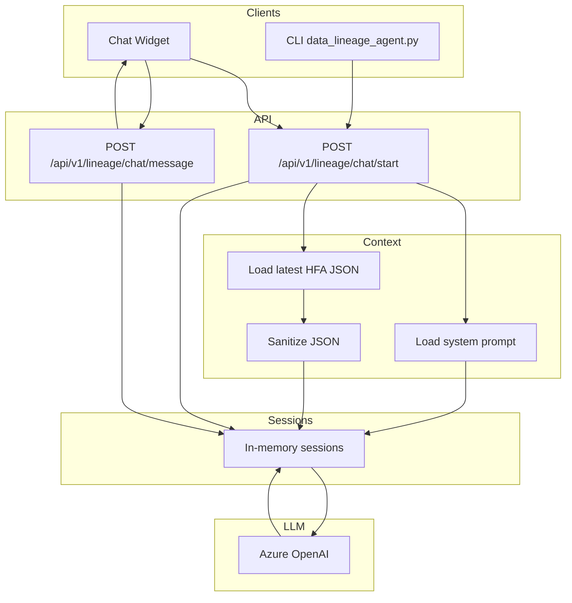

# Data Lineage Agent (HFA logs)

This agent starts a streaming Azure OpenAI chat session grounded on the latest JSON log in `logs/HFA/` for a selected ticker. It sends the full JSON to the model as context so you can ask lineage questions interactively.

- Code: `src/agents/data_lineage_agent.py`
- Prompt: `utils/data-lineage-agent-prompt.yaml`
- Logs directory: `logs/HFA/` with files named `{TICKER}_HFA_{YYYY-MM-DD_HHMMSS}.json`

## What it does
- Selects the newest JSON log for a ticker (by timestamp in the filename).
- Loads the entire JSON and sends it as chat context to Azure OpenAI.
- Uses your system prompt from `utils/data-lineage-agent-prompt.yaml` to keep answers strictly grounded in the JSON (lineage-focused).
- Starts an interactive streaming chat in your terminal.

## Agent Architecture



## Dependencies
Install these Python packages (PowerShell example):

```powershell
python -m pip install --upgrade pip
pip install openai python-dotenv pyyaml
```

Notes:
- `openai` provides the `AzureOpenAI` client used for streaming chat.
- `python-dotenv` loads `.env` from the project root.
- `pyyaml` loads the system prompt file.

## Configure environment
Set your Azure OpenAI values in `.env` at the project root:

```dotenv
AZURE_OPENAI_API_KEY="<your-api-key>"
# Optional overrides (defaults shown)
AZURE_OPENAI_ENDPOINT="https://pgim-dealio.cognitiveservices.azure.com/"
AZURE_OPENAI_DEPLOYMENT="gpt-4.1-mini"
AZURE_OPENAI_API_VERSION="2024-12-01-preview"
```

## Start a terminal chat
Example: start a chat on ticker `ELME` and ask an initial question.

```powershell
python src/agents/data_lineage_agent.py ELME --initial "What is Operating Expenses 2023?"
# or positional initial question
python src/agents/data_lineage_agent.py ELME "What is Operating Expenses 2023?"
```

Then continue chatting interactively:

```
You: Show how Free Cash Flow LTM 2025 is computed
You: List all periods you have for Interest Expense
You: exit
```

If you don’t pass `--initial`, you’ll drop straight into the chat loop and can type your first question there.

## Prompt customization
Edit `utils/data-lineage-agent-prompt.yaml` to tune the model’s behavior. The agent loads the `system_prompt` key and prepends it to the chat.

## How the latest file is selected
Files are matched by `{TICKER}_HFA_*.json` and sorted by the timestamp in the filename (`YYYY-MM-DD_HHMMSS`). If a timestamp can’t be parsed, file modification time is used.

## JSON structure (simplified)
The HFA JSON is expected to follow this shape (example):

```json
{
  "ticker": "ELME",
  "timestamp": "2025-09-19_125842",
{{ ... }}
    }
  }
}
```

Notes:
- Period keys may be years (e.g., `2024`), quarters (e.g., `Q1 2025`), or `LTM YYYY`).
- `sources` may include optional `fileUrl`, `sheet`, `cell` fields.

## Programmatic usage
Import and call the helper to get the latest JSON, or run the chat session programmatically:

```python
from src.agents.data_lineage_agent import get_combined_json_data

data = get_combined_json_data("ELME")
print(data["timestamp"], list(data["metrics"].keys())[:5])
```

## Troubleshooting
- "No data found for the requested ticker." when starting chat:
  - Ensure a matching file exists at `logs/HFA/{TICKER}_HFA_*.json`.
- ImportError for `openai` or `python-dotenv`:
  - Install the dependencies listed above.
- No streaming output:
  - Check that `AZURE_OPENAI_API_KEY` is present and correct in `.env`.
  - Ensure `AZURE_OPENAI_ENDPOINT` and `AZURE_OPENAI_DEPLOYMENT` are valid.

## Security and correctness
- The agent does not query the internet. It sends your latest JSON as context and follows your system prompt, keeping answers grounded.
- When sources are missing, it does not show values and responds with the strict message.

## Use in Web App (Floating Chat Widget)
The app includes a floating Data Lineage chatbot fixed to the bottom-right of `client/templates/index.html`.

- Select a ticker from the “Select Company” dropdown on the page.
- Click the chat button to open the widget and ask lineage questions (e.g., `Revenue 2024`, `Operating Expenses Q1 2025`).
- The widget starts a server-side chat session scoped to the selected ticker and maintains context across turns.

Server-side API (FastAPI in `app.py`):

- `POST /api/v1/lineage/chat/start`
  - Request JSON: `{ "ticker": "ELME" }`
  - Response JSON: `{ "session_id": "<uuid>" }`
  - Behavior: Seeds the conversation with the sanitized latest HFA JSON (excludes `__file_path__`) and system prompt from `utils/data-lineage-agent-prompt.yaml`.

- `POST /api/v1/lineage/chat/message`
  - Request JSON: `{ "session_id": "<uuid>", "message": "Revenue 2024" }`
  - Response JSON: `{ "session_id": "<uuid>", "reply": "..." }`

Notes:
- The server loads `.env` automatically on startup (`load_dotenv()` in `app.py`).
- The prompt explicitly forbids using the JSON file path as "Source File". If no `fileUrl` is present in sources, the assistant must output `N/A` for `Source File`, `Sheet`, and `Cell`.

